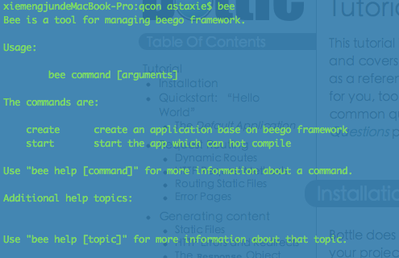

#Installation
Beego is a simple web framework, but it uses many third-party packages, so you have to install all dependency packages also.

- Before anything you do, you have to check that you installed Go in your computer, see more detail about Go installation in my book: [Chapter 1](https://github.com/Unknwon/build-web-application-with-golang_EN/blob/master/eBook/01.1.md)
- Use `go get ` to install Beego: 

		go get github.com/astaxie/beego
		
- Install bee tools for fast-develop Beego applications: 

		go get github.com/astaxie/bee		

Good job, you're ready to Beego with powerful bee tools! 

Beego has following dependency packages:

- Session module: [github.com/astaxie/beego/session](github.com/astaxie/beego/session)
- To support redis engine: [github.com/garyburd/redigo/redis](github.com/garyburd/redigo/redis)
- To support mysql engine: [github.com/go-sql-driver/mysql](github.com/go-sql-driver/mysql)
- To support markdown as template function: [github.com/russross/blackfriday](github.com/russross/blackfriday)

- [Introduction](README.md)
- [Quick start](Quickstart.md)