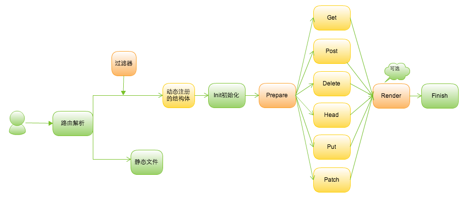

#Beego
Beego is a lightweight, open source, non-blocking and scalable web framework for the Go programming language. It's like tornado in Python. This web framework has already been using for building web server and tools in SNDA's CDN system. Documentation and downloads available at [http://astaxie.github.com/beego](http://astaxie.github.com/beego)

It has following main features:

- Supports MVC model, you only need to focus on logic and implementation methods.
- Supports websocket, use customized handlers to integrate sockjs.
- Supports customized router rules, including regex and semanteme.
- Session integration, supports memory, file, redis, mysql, etc.
- Automated parsing user form, you can get data very easy.
- Log level system, easy to record debugging and deployment logs.
- Use configuration file (.ini) to customized your system.
- Use built-in templates in Go, and it provides much more useful functions which are commonly used in web development.

The working principles of Beego as follows:

Beego is licensed under the Apache Licence, Version 2.0
(http://www.apache.org/licenses/LICENSE-2.0.html).

#Simple example
The following example prints string "Hello world" to your browser, it shows how easy to build a web application with Beego.

	package main

	import (
    	"github.com/astaxie/beego"
	)

	type MainController struct {
    	beego.Controller
	}

	func (this *MainController) Get() {
    	this.Ctx.WriteString("hello world")
	}

	func main() {
    	beego.Router("/", &MainController{})
    	beego.Run()
	}

#Handbook
- [Purposes](Why.md)
- [Installation](Install.md)
- [Quick start](Quickstart.md)
- [Step by step](Tutorial.md)
- [Real world usage](Application.md)
- [Hot update](HotUpdate.md)

#Documentation
[Go Walker](http://gowalker.org/github.com/astaxie/beego)