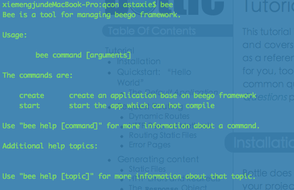

# 安装入门

beego虽然是一个简单的框架，但是其中用到了很多第三方的包，所以在你安装beego的过程中Go会自动安装其他关联的包。

- 当然第一步你需要安装Go，如何安装Go请参考我的书[第一章](https://github.com/astaxie/build-web-application-with-golang/blob/master/ebook/01.1.md)

- 安装beego

		go get github.com/astaxie/beego

- 安装bee工具,这个工具可以用来快速的建立beego的应用

		go get github.com/astaxie/bee

这样就完成了beego的安装，你就可以开始开发了,可以通过bee工具来创建beego项目

>beego依赖的第三方包有如下：

> - session模块：github.com/astaxie/beego/session

> - session模块中支持redis引擎：github.com/garyburd/redigo/redis

> - session模块中支持mysql引擎：github.com/go-sql-driver/mysql

- [beego介绍](README.md)
- [快速入门](Quickstart.md)
