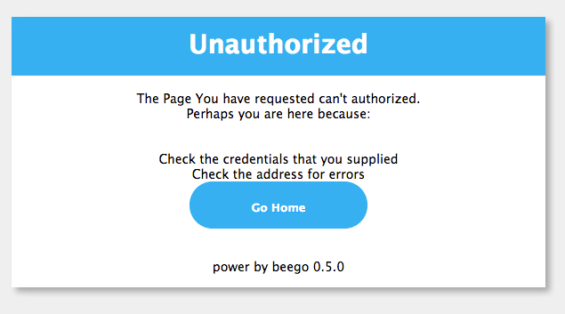

# 快速入门
你对beego一无所知？没关系，这篇文档会很好的详细介绍beego的各个方面，看这个文档之前首先确认你已经安装了beego，如果你没有安装的话，请看这篇[安装指南](Install.md)

**导航**

- [最小应用](#-1)
- [新建项目](#-2)
- [开发模式](#-3)
- [路由设置](#-4)
- [静态文件](#-5)
- [过滤和中间件](#-6)
- [Controller设计](#-7)
- [模板处理](#-8)
- [request处理](#request)
- [跳转和错误](#-15)
- [response处理](#response)
- [Sessions](#sessions)
- [Cache设置](#cache)
- [安全的Map](#map)
- [日志处理](#-16)
- [配置管理](#-17)
- [beego参数](#-18)
- [第三方应用集成](#-19)
- [部署编译应用](#-20)

## 最小应用
一个最小最简单的应用如下代码所示：

	package main

	import (
		"github.com/astaxie/beego"
	)
	
	type MainController struct {
		beego.Controller
	}
	
	func (this *MainController) Get() {
		this.Ctx.WriteString("hello world")
	}
	
	func main() {
		beego.Router("/", &MainController{})
		beego.Run()
	}

把上面的代码保存为hello.go，然后通过命令行进行编译并执行：

	$ go build main.go
	$ ./hello

这个时候你可以打开你的浏览器，通过这个地址浏览[http://127.0.0.1:8080](http://127.0.0.1:8080)返回“hello world”

那么上面的代码到底做了些什么呢？

1、首先我们引入了包`github.com/astaxie/beego`,我们知道Go语言里面引入包会深度优先的去执行引入包的初始化(变量和init函数，[更多](https://github.com/astaxie/build-web-application-with-golang/blob/master/ebook/02.3.md#maininit))，beego包中会初始化一个BeeAPP的应用，初始化一些参数。

2、定义Controller，这里我们定义了一个struct为`MainController`，充分利用了Go语言的组合的概念，匿名包含了`beego.Controller`，这样我们的`MainController`就拥有了`beego.Controller`的所有方法。

3、定义RESTFul方法，通过匿名组合之后，其实目前的`MainController`已经拥有了`Get`、`Post`、`Delete`、`Put`等方法，这些方法是分别用来对应用户请求的Method函数，如果用户发起的是`POST`请求，那么就执行`Post`函数。所以这里我们定义了`MainController`的`Get`方法用来重写继承的`Get`函数，这样当用户`GET`请求的时候就会执行该函数。
				
4、定义main函数，所有的Go应用程序和C语言一样都是Main函数作为入口，所以我们这里定义了我们应用的入口。

5、Router注册路由，路由就是告诉beego，当用户来请求的时候，该如何去调用相应的Controller，这里我们注册了请求`/`的时候，请求到`MainController`。这里我们需要知道，Router函数的两个参数函数，第一个是路径，第二个是Controller的指针。

6、Run应用，最后一步就是把在1中初始化的BeeApp开启起来，其实就是内部监听了8080端口:`Go默认情况会监听你本机所有的IP上面的8080端口`

停止服务的话，请按`ctrl+c`

## 新建项目

通过如下命令创建beego项目，首先进入gopath目录

	bee create hello
	
这样就建立了一个项目hello，目录结构如下所示

	.
	├── conf
	│   └── app.conf
	├── controllers
	│   └── default.go
	├── main.go
	├── models
	├── static
	│   ├── css
	│   ├── img
	│   └── js
	└── views
	    └── index.tpl

## 开发模式

通过bee创建的项目，beego默认情况下是开发模式。
	
我们可以通过如下的方式改变我们的模式：

	beego.RunMode = "pro"

或者我们在conf/app.conf下面设置如下：

	runmode = pro

以上两种效果一样。

开发模式中

- 开发模式下，如果你的目录不存在views目录，那么会出现类似下面的错误提示：

		2013/04/13 19:36:17 [W] [stat views: no such file or directory]

- 模板会自动重新加载不缓存。
- 如果服务端出错，那么就会在浏览器端显示如下类似的截图：

## 路由设置

路由的主要功能是实现从请求地址到实现方法，beego中封装了`Controller`，所以路由是从路径到`ControllerInterface`的过程，`ControllerInterface`的方法有如下：

	type ControllerInterface interface {
		Init(ct *Context, cn string)
		Prepare()
		Get()
		Post()
		Delete()
		Put()
		Head()
		Patch()
		Options()
		Finish()
		Render() error
	}

这些方法`beego.Controller`都已经实现了，所以只要用户定义struct的时候匿名包含就可以了。当然更灵活的方法就是用户可以去自定义类似的方法，然后实现自己的逻辑。

用户可以通过如下的方式进行路由设置：

	beego.Router("/", &controllers.MainController{})
	beego.Router("/admin", &admin.UserController{})
	beego.Router("/admin/index", &admin.ArticleController{})
	beego.Router("/admin/addpkg", &admin.AddController{})

为了用户更加方便的路由设置，beego参考了sinatra的路由实现，支持多种方式的路由：

- beego.Router("/api/:id([0-9]+)", &controllers.RController{})    
	自定义正则匹配	//匹配 /api/123 :id= 123 

- beego.Router("/news/:all", &controllers.RController{})    
	全匹配方式 //匹配 /news/path/to/123.html :all= path/to/123.html
	
- beego.Router(\`/user/:username([\w]+)\`, &controllers.RController{})    
	正则字符串匹配 //匹配 /user/astaxie    :username = astaxie
	
- beego.Router("/download/*.*", &controllers.RController{})    
	*匹配方式 //匹配 /download/file/api.xml     :path= file/api   :ext=xml
	
- beego.Router("/download/ceshi/*", &controllers.RController{})   
	*全匹配方式 //匹配  /download/ceshi/file/api.json  :splat=file/api.json
	
- beego.Router("/:id:int", &controllers.RController{})    
	int类型设置方式  //匹配 :id为int类型，框架帮你实现了正则([0-9]+)
	
- beego.Router("/:hi:string", &controllers.RController{})   
	string类型设置方式 //匹配 :hi为string类型。框架帮你实现了正则([\w]+)
	
如何在Controller中获取，上面的变量可以通过如下方式获取

	this.Ctx.Params[":id"]	
	this.Ctx.Params[":username"]	
	this.Ctx.Params[":splat"]	
	this.Ctx.Params[":path"]	
	this.Ctx.Params[":ext"]	

## 静态文件
Go语言内部其实已经提供了`http.ServeFile`，通过这个函数可以实现静态文件的服务。beego针对这个功能进行了一层封装，通过下面的方式进行静态文件注册：

	beego.SetStaticPath("/static","public")
	
- 第一个参数是路径，url路径信息
- 第二个参数是静态文件目录（相对应用所在的目录）

beego支持多个目录的静态文件注册，用户可以注册如下的静态文件目录：

	beego.SetStaticPath("/images","images")
	beego.SetStaticPath("/css","css")
	beego.SetStaticPath("/js","js")

设置了如上的静态目录之后，用户访问`/images/login/login.png`，那么就会访问应用对应的目录下面的`images/login/login.png`文件。如果是访问`/static/img/logo.png`，那么就访问`public/img/logo.png`文件。

## 过滤和中间件
beego支持自定义过滤中间件，例如安全验证，强制跳转等

如下例子所示，验证用户名是否是admin，应用于全部的请求：

	var FilterUser = func(w http.ResponseWriter, r *http.Request) {
	    if r.URL.User == nil || r.URL.User.Username() != "admin" {
	        http.Error(w, "", http.StatusUnauthorized)
	    }
	}

	beego.Filter(FilterUser)
	
还可以通过参数进行过滤，如果匹配参数就执行

	beego.Router("/:id([0-9]+)", &admin.EditController{})
	beego.FilterParam("id", func(rw http.ResponseWriter, r *http.Request) {
	    dosomething()
	})
	
当然你还可以通过前缀过滤

	beego.FilterPrefixPath("/admin", func(rw http.ResponseWriter, r *http.Request) {
	    dosomething()
	})

## 控制器设计
基于beego的Controller设计，只需要匿名组合`beego.Controller`就可以了，如下所示：

	type xxxController struct {
	    beego.Controller
	}

`beego.Controller`实现了接口`beego.ControllerInterface`，`beego.ControllerInterface`定义了如下函数：

- Init(ct *Context, cn string)

	这个函数主要初始化了Context、相应的Controller名称，模板名，初始化模板参数的容器Data
	
- Prepare()

	这个函数主要是为了用户扩展用的，这个函数会在下面定义的这些Method方法之前执行，用户可以重写这个函数实现类似用户验证之类。
   
- Get()

	如果用户请求的HTTP Method是GET, 那么就执行该函数，默认是403，用户继承的子struct中可以实现了该方法以处理Get请求.
	
- Post()

	如果用户请求的HTTP Method是POST, 那么就执行该函数，默认是403，用户继承的子struct中可以实现了该方法以处理Post请求.

- Delete()

	如果用户请求的HTTP Method是DELETE, 那么就执行该函数，默认是403，用户继承的子struct中可以实现了该方法以处理Delete请求.

- Put()

	如果用户请求的HTTP Method是PUT, 那么就执行该函数，默认是403，用户继承的子struct中可以实现了该方法以处理Put请求.

- Head()

	如果用户请求的HTTP Method是HEAD, 那么就执行该函数，默认是403，用户继承的子struct中可以实现了该方法以处理Head请求.

- Patch()

	如果用户请求的HTTP Method是PATCH, 那么就执行该函数，默认是403，用户继承的子struct中可以实现了该方法以处理Patch请求.

- Options()

	如果用户请求的HTTP Method是OPTIONS, 那么就执行该函数，默认是403，用户继承的子struct中可以实现了该方法以处理Options请求.

- Finish()

	这个函数实在执行完相应的http Method方法之后执行的，默认是空，用户可以在子Strcut中重写这个函数，执行例如数据库关闭，清理数据之类的工作

- Render() error

	这个函数主要用来实现渲染模板，如果beego.AutoRender为true的情况下才会执行。

所以通过子struct的方法重写，用户就可以实现自己的逻辑，接下来我们看一个实际的例子：

	type AddController struct {
	    beego.Controller
	}
	
	func (this *AddController) Prepare() {
	
	}
	
	func (this *AddController) Get() {
		this.Data["content"] ="value"
	    this.Layout = "admin/layout.html"
	    this.TplNames = "admin/add.tpl"
	}
	
	func (this *AddController) Post() {
	    pkgname := this.GetString("pkgname")
	    content := this.GetString("content")
	    pk := models.GetCruPkg(pkgname)
	    if pk.Id == 0 {
	        var pp models.PkgEntity
	        pp.Pid = 0
	        pp.Pathname = pkgname
	        pp.Intro = pkgname
	        models.InsertPkg(pp)
	        pk = models.GetCruPkg(pkgname)
	    }
	    var at models.Article
	    at.Pkgid = pk.Id
	    at.Content = content
	    models.InsertArticle(at)
	    this.Ctx.Redirect(302, "/admin/index")
	}	

## 模板处理
### 模板目录
beego中默认的模板目录是`views`，用户可以把你的模板文件放到该目录下，beego会自动在该目录下的所有模板文件进行解析并缓存，开发模式下会每次重新解析，不做缓存。当然用户可以通过如下的方式改变模板的目录：

	beego.ViewsPath = "/myviewpath"
### 自动渲染
beego中用户无需手动的调用渲染输出模板，beego会自动的在调用玩相应的method方法之后调用Render函数，当然如果你的应用是不需要模板输出的，那么你可以在配置文件或者在main.go中设置关闭自动渲染。

配置文件配置如下：
	
	autorender = false

main.go文件中设置如下：

	beego.AutoRender = false
	
### 模板数据
模板中的数据是通过在Controller中`this.Data`获取的，所以如果你想在模板中获取内容`{{.Content}}`,那么你需要在Controller中如下设置：
	
	this.Data["Context"] = "value"
		
### 模板名称
beego采用了Go语言内置的模板引擎，所有模板的语法和Go的一模一样，至于如何写模板文件，详细的请参考[模板教程](https://github.com/astaxie/build-web-application-with-golang/blob/master/ebook/07.4.md)。

用户通过在Controller的对应方法中设置相应的模板名称，beego会自动的在viewpath目录下查询该文件并渲染，例如下面的设置，beego会在admin下面找add.tpl文件进行渲染：

	this.TplNames = "admin/add.tpl"

我们看到上面的模板后缀名是tpl，beego默认情况下支持tpl和html后缀名的模板文件，如果你的后缀名不是这两种，请进行如下设置：

	beego.AddTemplateExt("你文件的后缀名")

当你设置了自动渲染，然后在你的Controller中没有设置任何的TplNames，那么beego会自动设置你的模板文件如下：

	c.TplNames = c.ChildName + "/" + c.Ctx.Request.Method + "." + c.TplExt

也就是你对应的Controller名字+请求方法名.模板后缀，也就是如果你的Controller名是`AddController`，请求方法是`POST`，默认的文件后缀是`tpl`，那么就会默认请求`/viewpath/AddController/POST.tpl`文件。

### layout设计
beego支持layout设计，例如你在管理系统中，其实整个的管理界面是固定的，只会变化中间的部分，那么你可以通过如下的设置：
	
	this.Layout = "admin/layout.html"
	this.TplNames = "admin/add.tpl" 

在layout.html中你必须设置如下的变量：

	{{.LayoutContent}}
	
beego就会首先解析TplNames指定的文件，获取内容赋值给LayoutContent，然后最后渲染layout.html文件。

目前采用首先把目录下所有的文件进行缓存，所以用户还可以通过类似这样的方式实现layout：

	{{template "header.html"}}
	处理逻辑
	{{template "footer.html"}}

### 模板函数
beego支持用户定义模板函数，但是必须在`beego.Run()`调用之前，设置如下：

	func hello(in string)(out string){
	    out = in + "world"
	    return
	}
	
	beego.AddFuncMap("hi",hello)

定义之后你就可以在模板中这样使用了：

	{{.Content | hi}}

目前beego内置的模板函数有如下：

* markdown 
	
	实现了把markdown文本转化为html信息，使用方法{{markdown .Content}}
* dateformat 

	实现了时间的格式化，返回字符串，使用方法{{dateformat .Time "2006-01-02T15:04:05Z07:00"}}
* date 

	实现了类似PHP的date函数，可以很方便的根据字符串返回时间，使用方法{{date .T "Y-m-d H:i:s"}}
* compare 

	实现了比较两个对象的比较，如果相同返回true，否者false，使用方法{{compare .A .B}}
* substr 

	实现了字符串的截取，支持中文截取的完美截取，使用方法{{substr .Str 0 30}}
* html2str 

	实现了把html转化为字符串，剔除一些script、css之类的元素，返回纯文本信息，使用方法{{html2str .Htmlinfo}}
* str2html 

	实现了把相应的字符串当作HTML来输出，不转义，使用方法{{str2html .Strhtml}}
* htmlquote 

	实现了基本的html字符转义，使用方法{{htmlquote .quote}}
* htmlunquote 	

	实现了基本的反转移字符，使用方法{{htmlunquote .unquote}}
	
## request处理
我们经常需要获取用户传递的数据，包括Get、POST等方式的请求，beego里面会自动解析这些数据，你可以通过如下方式获取数据

- GetString(key string) string
- GetInt(key string) (int64, error)
- GetBool(key string) (bool, error)

使用例子如下：

	func (this *MainController) Post() {
		jsoninfo := this.GetString("jsoninfo")
		if jsoninfo == "" {
			this.Ctx.WriteString("jsoninfo is empty")
			return
		}
	}

如果你需要的数据可能是其他类型的，例如是int类型而不是int64，那么你需要这样处理：

	func (this *MainController) Post() {
		id := this.Input().Get("id")
		intid, err := strconv.Atoi(id)
	}		

更多其他的request的信息，用户可以通过`this.Ctx.Request`获取信息，关于该对象的属性和方法参考手册[Request](http://golang.org/pkg/net/http/#Request)

### 文件上传
在beego中你可以很容易的处理文件上传，就是别忘记在你的form表单中增加这个属性`enctype="multipart/form-data"`，否者你的浏览器不会传输你的上传文件。

文件上传之后一般是放在系统的内存里面，如果文件的size大于设置的缓存内存大小，那么就放在临时文件中，默认的缓存内存是64M，你可以通过如下来调整这个缓存内存大小:

	beego.MaxMemory = 1<<22 

或者在配置文件中通过如下设置

	maxmemory = 1<<22

beego提供了两个很方便的方法来处理文件上传：

- GetFile(key string) (multipart.File, *multipart.FileHeader, error)

	该方法主要用于用户读取表单中的文件名`the_file`，然后返回相应的信息，用户根据这些变量来处理文件上传：过滤、保存文件等。
	
- SaveToFile(fromfile, tofile string) error

	该方法是在GetFile的基础上实现了快速保存的功能
	
保存的代码例子如下：
	
	func (this *MainController) Post() {
		this.SaveToFile("the_file","/var/www/uploads/uploaded_file.txt"")
	}

### JSON和XML输出
beego当初设计的时候就考虑了API功能的设计，而我们在设计API的时候经常是输出JSON或者XML数据，那么beego提供了这样的方式直接输出：

JSON数据直接输出，设置`content-type`为`application/json`：

	func (this *AddController) Get() {
	    mystruct := { ... }
	    this.Data["json"] = &mystruct
	    this.ServeJson()
	}	

XML数据直接输出，设置`content-type`为`application/xml`：

	func (this *AddController) Get() {
	    mystruct := { ... }
	    this.Data["xml"]=&mystruct
	    this.ServeXml()
	}	
	
## 跳转和错误
我们在做Web开发的时候，经常会遇到页面调整和错误处理，beego这这方面也进行了考虑，通过`Redirect`方法来进行跳转：

	func (this *AddController) Get() {
	   this.Redirect("/", 302)
	}	

如何中止此次请求并抛出异常，beego可以在控制器中这操作

	func (this *MainController) Get() {
		this.Abort("401")
		v := this.GetSession("asta")
		if v == nil {
			this.SetSession("asta", int(1))
			this.Data["Email"] = 0
		} else {
			this.SetSession("asta", v.(int)+1)
			this.Data["Email"] = v.(int)
		}
		this.TplNames = "index.tpl"	
	}

这样`this.Abort("401")`之后的代码不会再执行，而且会默认显示给用户如下页面

	

beego框架默认支持404、401、403、500、503这几种错误的处理。用户可以自定义相应的错误处理，例如下面重新定义404页面：

	func page_not_found(rw http.ResponseWriter, r *http.Request){
		t,_:= template.New("beegoerrortemp").ParseFiles(beego.ViewsPath+"/404.html")
		data :=make(map[string]interface{})
		data["content"] = "page not found"
		t.Execute(rw, data)
	}
	
	func main() {
		beego.Errorhandler("404",page_not_found)
		beego.Router("/", &controllers.MainController{})
		beego.Run()
	}	

我们可以通过自定义错误页面`404.html`来处理404错误。

beego更加人性化的还有一个设计就是支持用户自定义字符串错误类型处理函数，例如下面的代码，用户注册了一个数据库出错的处理页面：

	func dbError(rw http.ResponseWriter, r *http.Request){
		t,_:= template.New("beegoerrortemp").ParseFiles(beego.ViewsPath+"/dberror.html")
		data :=make(map[string]interface{})
		data["content"] = "database is now down"
		t.Execute(rw, data)
	}

	func main() {
		beego.Errorhandler("dbError",dbError)
		beego.Router("/", &controllers.MainController{})
		beego.Run()
	}	

一旦在入口注册该错误处理代码，那么你可以在任何你的逻辑中遇到数据库错误调用`this.Abort("dbError")`来进行异常页面处理。

## response处理
response可能会有集中情况：

1. 模板输出

	模板输出上面模板介绍里面已经介绍，beego会在执行完相应的Controller里面的对应的Method之后输出到模板。
	
2. 跳转

	上一节介绍的跳转就是我们经常用到的页面之间的跳转
	
3. 字符串输出

	有些时候我们只是想输出相应的一个字符串，那么我们可以通过如下的代码实现
	
		this.Ctx.WriteString("ok")

## Sessions
beego内置了session模块，目前session模块支持的后端引擎包括memory、file、mysql、redis四中，用户也可以根据相应的interface实现自己的引擎。

beego中使用session相当方便，只要在main入口函数中设置如下：

	beego.SessionOn = true

或者通过配置文件配置如下：

	sessionon = true

通过这种方式就可以开启session，如何使用session，请看下面的例子：

	func (this *MainController) Get() {
		v := this.GetSession("asta")
		if v == nil {
			this.SetSession("asta", int(1))
			this.Data["num"] = 0
		} else {
			this.SetSession("asta", v.(int)+1)
			this.Data["num"] = v.(int)
		}
		this.TplNames = "index.tpl"
	}

上面的例子中我们知道session有几个方便的方法：

- SetSession(name string, value interface{})
- GetSession(name string) interface{}
- DelSession(name string)

session操作主要有设置session、获取session、删除session

当然你要可以通过下面的方式自己控制相应的逻辑这些逻辑：

	sess:=this.StartSession()
	defer sess.SessionRelease()

sess对象具有如下方法：

* sess.Set()
* sess.Get()
* sess.Delete()
* sess.SessionID()

但是我还是建议大家采用SetSession、GetSession、DelSession三个方法来操作，避免自己在操作的过程中资源没释放的问题。

关于Session模块使用中的一些参数设置：

- SessionOn

	设置是否开启Session，默认是false，配置文件对应的参数名：sessionon
	
- SessionProvider

	设置Session的引擎，默认是memory，目前支持还有file、mysql、redis等，配置文件对应的参数名：sessionprovider
	
- SessionName

	设置cookies的名字，Session默认是保存在用户的浏览器cookies里面的，默认名是beegosessionID，配置文件对应的参数名是：sessionname
	
- SessionGCMaxLifetime

	设置Session过期的时间，默认值是3600秒，配置文件对应的参数：sessiongcmaxlifetime
	
- SessionSavePath
	
	设置对应file、mysql、redis引擎的保存路径或者链接地址，默认值是空，配置文件对应的参数：sessionsavepath

当SessionProvider为file时，SessionSavePath是只保存文件的目录，如下所示：

	beego.SessionProvider = "file"
	beego.SessionSavePath = "./tmp"

当SessionProvider为mysql时，SessionSavePath是链接地址，采用[go-sql-driver](https://github.com/go-sql-driver/mysql)，如下所示：

	beego.SessionProvider = "mysql"
	beego.SessionSavePath = "username:password@protocol(address)/dbname?param=value"
	
当SessionProvider为redis时，SessionSavePath是redis的链接地址，采用了[redigo](https://github.com/garyburd/redigo)，如下所示：

	beego.SessionProvider = "redis"
	beego.SessionSavePath = "127.0.0.1:6379"	

## Cache设置
beego内置了一个cache模块，实现了类似memcache的功能，缓存数据在内存中，主要的使用方法如下：

	var (
		urllist *beego.BeeCache
	)
	
	func init() {
		urllist = beego.NewBeeCache()
		urllist.Every = 0 //不过期
		urllist.Start()
	}

	func (this *ShortController) Post() {
		var result ShortResult
		longurl := this.Input().Get("longurl")
		beego.Info(longurl)
		result.UrlLong = longurl
		urlmd5 := models.GetMD5(longurl)
		beego.Info(urlmd5)
		if urllist.IsExist(urlmd5) {
			result.UrlShort = urllist.Get(urlmd5).(string)
		} else {
			result.UrlShort = models.Generate()
			err := urllist.Put(urlmd5, result.UrlShort, 0)
			if err != nil {
				beego.Info(err)
			}
			err = urllist.Put(result.UrlShort, longurl, 0)
			if err != nil {
				beego.Info(err)
			}
		}
		this.Data["json"] = result
		this.ServeJson()
	}	
	
上面这个例子演示了如何使用beego的Cache模块，主要是通过`beego.NewBeeCache`初始化一个对象，然后设置过期时间，开启过期检测，在业务逻辑中就可以通过如下的接口进行增删改的操作：

- Get(name string) interface{}
- Put(name string, value interface{}, expired int) error
- Delete(name string) (ok bool, err error)
- IsExist(name string) bool

## 安全的Map
我们知道在Go语言里面map是非线程安全的，详细的[atomic_maps](http://golang.org/doc/faq#atomic_maps)。但是我们在平常的业务中经常需要用到线程安全的map，特别是在goroutine的情况下，所以beego内置了一个简单的线程安全的map：

	bm := NewBeeMap()
	if !bm.Set("astaxie", 1) {
		t.Error("set Error")
	}
	if !bm.Check("astaxie") {
		t.Error("check err")
	}

	if v := bm.Get("astaxie"); v.(int) != 1 {
		t.Error("get err")
	}

	bm.Delete("astaxie")
	if bm.Check("astaxie") {
		t.Error("delete err")
	}
	
上面演示了如何使用线程安全的Map，主要的接口有：

- Get(k interface{}) interface{}
- Set(k interface{}, v interface{}) bool
- Check(k interface{}) bool
- Delete(k interface{})

## 日志处理
beego默认有一个初始化的BeeLogger对象输出内容到stdout中，你可以通过如下的方式设置自己的输出：

	beego.SetLogger(*log.Logger)

只要你的输出符合`*log.Logger`就可以，例如输出到文件：

	fd,err := os.OpenFile("/var/log/beeapp/beeapp.log", os.O_RDWR|os.O_APPEND, 0644)
	if err != nil {
	    beego.Critical("openfile beeapp.log:", err)
	    return
	}
	lg := log.New(fd, "", log.Ldate|log.Ltime)
	beego.SetLogger(lg)
### 不同级别的log日志函数

* Trace(v ...interface{})
* Debug(v ...interface{})
* Info(v ...interface{})
* Warn(v ...interface{})
* Error(v ...interface{})
* Critical(v ...interface{})

你可以通过下面的方式设置不同的日志分级：

	beego.SetLevel(beego.LevelError)
	
当你代码中有很多日志输出之后，如果想上线，但是你不想输出Trace、Debug、Info等信息，那么你可以设置如下：

	beego.SetLevel(beego.LevelWarning)

这样的话就不会输出小于这个level的日志，日志的排序如下：

LevelTrace、LevelDebug、LevelInfo、LevelWarning、	LevelError、LevelCritical	

用户可以根据不同的级别输出不同的错误信息，如下例子所示：

### Examples of log messages
- Trace

	* "Entered parse function validation block"
	* "Validation: entered second 'if'"
	* "Dictionary 'Dict' is empty. Using default value"
- Debug

	* "Web page requested: http://somesite.com Params='...'"
	* "Response generated. Response size: 10000. Sending."
	* "New file received. Type:PNG Size:20000"
- Info
	* "Web server restarted"
	* "Hourly statistics: Requested pages: 12345 Errors: 123 ..."
	* "Service paused. Waiting for 'resume' call"
- Warn
	* "Cache corrupted for file='test.file'. Reading from back-end"
	* "Database 192.168.0.7/DB not responding. Using backup 192.168.0.8/DB"
	* "No response from statistics server. Statistics not sent"
- Error
	* "Internal error. Cannot process request #12345 Error:...."
	* "Cannot perform login: credentials DB not responding"
- Critical
	* "Critical panic received: .... Shutting down"
	* "Fatal error: ... App is shutting down to prevent data corruption or loss"
	
### Example

	func internalCalculationFunc(x, y int) (result int, err error) {
		beego.Debug("calculating z. x:",x," y:",y)
		z := y
		switch {
		case x == 3 :
			beego.Trace("x == 3")
			panic("Failure.")
		case y == 1 :
			beego.Trace("y == 1")
			return 0, errors.New("Error!")
		case y == 2 :
			beego.Trace("y == 2")
			z = x
		default :
			beego.Trace("default")
			z += x
		}
		retVal := z-3
		beego.Debug("Returning ", retVal)
				
		return retVal, nil
	}	
	
	func processInput(input inputData) {
		defer func() {
			if r := recover(); r != nil {
	            beego.Error("Unexpected error occurred: ", r)
				outputs <- outputData{result : 0, error : true}
	        }
		}()
		beego.Info("Received input signal. x:",input.x," y:", input.y)	
		
		res, err := internalCalculationFunc(input.x, input.y)	
		if err != nil {
			beego.Warn("Error in calculation:", err.Error())
		}
		
		beego.Info("Returning result: ",res," error: ",err)		
		outputs <- outputData{result : res, error : err != nil}	
	}
	
	func main() {
		inputs = make(chan inputData)
		outputs = make(chan outputData)
		criticalChan = make(chan int)
		beego.Info("App started.")
		
		go consumeResults(outputs)
		beego.Info("Started receiving results.")
		
		go generateInputs(inputs)
		beego.Info("Started sending signals.")
		
		for {
			select {
				case input := <- inputs:
					processInput(input)
				case <- criticalChan:
					beego.Critical("Caught value from criticalChan: Go shut down.")
					panic("Shut down due to critical fault.")
			}	
		}
	}

## 配置管理
beego支持解析ini文件, beego默认会解析当前应用下的`conf/app.conf`文件

通过这个文件你可以初始化很多beego的默认参数

	appname = beepkg
	httpaddr = "127.0.0.1"
	httpport = 9090
	runmode ="dev"
	autorender = false
	autorecover = false
	viewspath = "myview"
	
上面这些参数会替换beego默认的一些参数。

你可以在配置文件中配置应用需要用的一些配置信息，例如下面所示的数据库信息：

	mysqluser = "root"
	mysqlpass = "rootpass"
	mysqlurls = "127.0.0.1"
	mysqldb   = "beego"
	
那么你就可以通过如下的方式获取设置的配置信息:

	beego.AppConfig.String("mysqluser")
	beego.AppConfig.String("mysqlpass")
	beego.AppConfig.String("mysqlurls")
	beego.AppConfig.String("mysqldb")

AppConfig支持如下方法

- Bool(key string) (bool, error)
- Int(key string) (int, error)
- Int64(key string) (int64, error)
- Float(key string) (float64, error)
- String(key string) string

## 系统默认参数
beego中带有很多可配置的参数，我们来一一认识一下它们，这样有利于我们在接下来的beego开发中可以充分的发挥他们的作用：

* BeeApp

	beego默认启动的一个应用器入口，在应用import beego的时候，在init中已经初始化的。
	
* AppConfig

	beego的配置文件解析之后的对象，也是在init的时候初始化的，里面保存有解析`conf/app.conf`下面所有的参数数据
	
* AppConfigPath

	配置文件所在的路径，默认是应用程序对应的目录下的`conf/app.conf`，用户可以修改该值配置自己的配置文件	
	
* HttpAddr

	应用监听地址，默认为空，监听所有的网卡IP
	
* HttpPort

	应用监听端口，默认为8080
	
* AppName

	应用名称，默认是beego
	
* RunMode 

	应用的模式，默认是dev，为开发模式，在开发模式下出错会提示友好的出错页面，如前面错误描述中所述。
	
* AutoRender

	是否模板自动渲染，默认值为true，对于API类型的应用，应用需要把该选项设置为false，不需要渲染模板。
	
* RecoverPanic

	是否异常恢复，默认值为true，即当应用出现异常的情况，通过recover恢复回来，而不会导致应用异常退出。
	
* PprofOn

	是否启用pprof，默认是false，当开启之后，用户可以通过如下地址查看相应的goroutine执行情况
	
		/debug/pprof
		/debug/pprof/cmdline
		/debug/pprof/profile
		/debug/pprof/symbol 
	关于pprof的信息，请参考官方的描述[pprof](http://golang.org/pkg/net/http/pprof/)	
	
* ViewsPath

	模板路径，默认值是views
	
* SessionOn

	session是否开启，默认是false
	
* SessionProvider

	session的引擎，默认是memory
	
* SessionName

	存在客户端的cookie名称，默认值是beegosessionID
	
* SessionGCMaxLifetime

	session过期时间，默认值是3600秒
	
* SessionSavePath

	session保存路径，默认是空
	
* UseFcgi

	是否启用fastcgi，默认是false
	
* MaxMemory

	文件上传默认内存缓存大小，默认值是`1 << 26`(64M)
	
* EnableGzip

	是否开启gzip支持，默认为false不支持gzip，一旦开启了gzip，那么在模板输出的内容会进行gzip或者zlib压缩，根据用户的Accept-Encoding来判断。	

## 第三方应用集成
beego支持第三方应用的集成，用户可以自定义`http.Handler`,用户可以通过如下方式进行注册路由：

	beego.RouterHandler("/chat/:info(.*)", sockjshandler)
	
sockjshandler实现了接口`http.Handler`。

目前在beego的example中有支持sockjs的chat例子，示例代码如下：

	package main
	
	import (
		"fmt"
		"github.com/astaxie/beego"
		"github.com/fzzy/sockjs-go/sockjs"
		"strings"
	)
	
	var users *sockjs.SessionPool = sockjs.NewSessionPool()
	
	func chatHandler(s sockjs.Session) {
		users.Add(s)
		defer users.Remove(s)
	
		for {
			m := s.Receive()
			if m == nil {
				break
			}
			fullAddr := s.Info().RemoteAddr
			addr := fullAddr[:strings.LastIndex(fullAddr, ":")]
			m = []byte(fmt.Sprintf("%s: %s", addr, m))
			users.Broadcast(m)
		}
	}
	
	type MainController struct {
		beego.Controller
	}
	
	func (m *MainController) Get() {
		m.TplNames = "index.html"
	}
	
	func main() {
		conf := sockjs.NewConfig()
		sockjshandler := sockjs.NewHandler("/chat", chatHandler, conf)
		beego.Router("/", &MainController{})
		beego.RouterHandler("/chat/:info(.*)", sockjshandler)
		beego.Run()
	}

通过上面的代码很简单的实现了一个多人的聊天室。上面这个只是一个sockjs的例子，我想通过大家自定义`http.Handler`，可以有很多种方式来进行扩展beego应用。

## 部署编译应用
Go语言的应用最后编译之后是一个二进制文件，你只需要copy这个应用到服务器上，运行起来就行。beego由于带有几个静态文件、配置文件、模板文件三个目录，所以用户部署的时候需要同时copy这三个目录到相应的部署应用之下，下面以我实际的应用部署为例：

	$ mkdir /opt/app/beepkg
	$ cp beepkg /opt/app/beepkg
	$ cp -fr views /opt/app/beepkg
	$ cp -fr static /opt/app/beepkg
	$ cp -fr conf /opt/app/beepkg
	
这样在`/opt/app/beepkg`目录下面就会显示如下的目录结构：

	.
	├── conf
	│   ├── app.conf
	├── static
	│   ├── css
	│   ├── img
	│   └── js
	└── views
	    └── index.tpl
	├── beepkg	

这样我们就已经把我们需要的应用搬到服务器了，那么接下来就可以开始部署了，我现在服务器端用两种方式来run，

- Supervisord 
	
	安装和配置见[Supervisord](Supervisord.md)

- nohup方式

	nohup ./beepkg &

个人比较推荐第一种方式，可以很好的管理起来应用

- [beego介绍](README.md)
- [一步一步开发应用](Tutorial.md)
