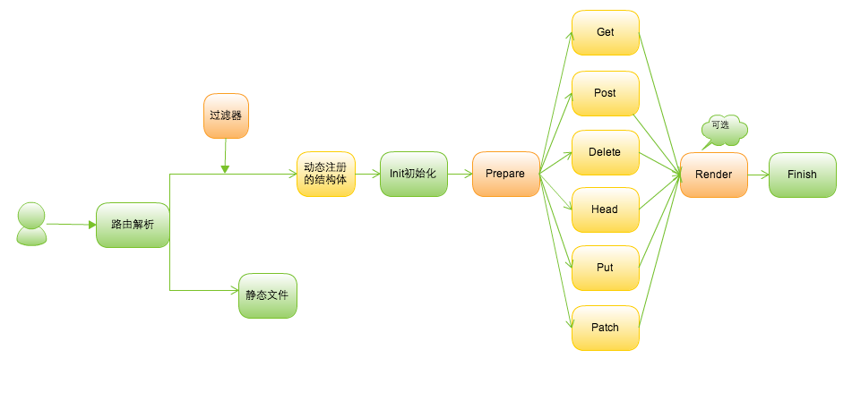

# beego介绍
beego是一个类似tornado的Go应用框架，采用了RESTFul的方式来实现应用框架，是一个超轻量级的框架，主要有如下的特点：

- 支持MVC的方式，用户只需要关注逻辑，实现对应method的方法即可
- 支持websocket，通过自定义Handler实现集成sockjs等方式实现
- 支持自定义路由，支持各种方式的路由，正则、语意均支持，类似sinatra
- session集成，支持memory、file、redis、mysql等存储
- 表单处理自动化解析，用户可以很方便的获取数据
- 日志分级系统，用户可以很方便的调试和应用日志记录
- 自定义配置文件，支持ini格式的文本配置，可以方便的在系统中调参数
- 采用了Go内置的模板，集成实现了很多Web开发中常用的函数

执行过程如下所示：

# beego简单例子

	package main
	
	import (
		"github.com/astaxie/beego"
	)
	
	type MainController struct {
		beego.Controller
	}
	
	func (this *MainController) Get() {
		this.Ctx.WriteString("hello world")
	}
	
	func main() {
		beego.Router("/", &MainController{})
		beego.Run()
	}

# beego 指南

* [为什么设计beego](Why.md)
* [安装入门](Install.md)
* [快速入门](Quickstart.md)
* [一步一步开发应用](Tutorial.md)
* [beego案例](Application.md)
* [热升级](HotUpdate.md)

# API接口

API对于我们平时开发应用非常有用，用于查询一些开发的函数，godoc做的非常好了

[Go Walker](http://gowalker.org/github.com/astaxie/beego)
